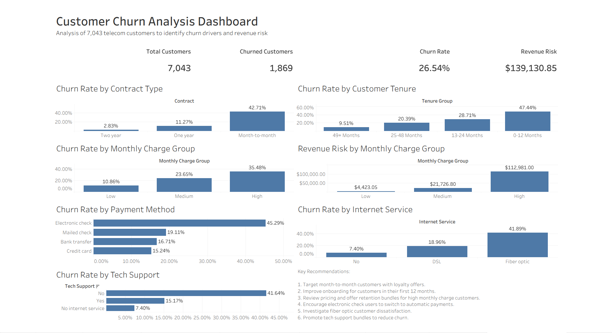

# Customer Churn Analysis

## Project Overview

This project analyzes customer churn for a telecommunications company using Excel, SQL, Python, and Tableau. The objective is to identify the key factors contributing to customer churn and provide actionable business recommendations to improve customer retention and reduce revenue loss.

---

## Business Problem

Customer churn directly impacts company revenue and customer lifetime value. The goal of this project is to identify high-risk customer groups and recommend strategies to reduce churn.

---

## Tools Used

- Microsoft Excel / Google Sheets
- MySQL
- Python (Pandas, Matplotlib)
- Tableau
- GitHub

---

## Dataset

- IBM Telco Customer Churn Dataset
- 7,043 customer records
- Customer demographics
- Account information
- Services subscribed
- Churn status

---

## Project Workflow

1. Data Cleaning using Excel
2. Exploratory Data Analysis
3. SQL Business Analysis
4. Interactive Tableau Dashboard
5. Python Data Analysis
6. Business Insights and Recommendations

---

## Key Findings

- Overall Churn Rate: **26.54%**
- Churned Customers: **1,869**
- Revenue at Risk: **$139,130.85**

### Highest Risk Customers

- Month-to-month contracts
- Customers within their first 12 months
- High monthly charges
- Electronic check payment users
- Fiber optic internet customers
- Customers without Tech Support

---

## Business Recommendations

1. Offer loyalty incentives for month-to-month customers.
2. Improve onboarding during the first year.
3. Provide retention offers for high monthly charge customers.
4. Encourage automatic payment methods.
5. Investigate dissatisfaction among fiber optic customers.
6. Promote Tech Support bundles.

---

## Project Structure

```text
Customer_Churn_Analysis
│
├── data
│   └── customer_churn_cleaned.csv
│
├── sql
│   └── churn_analysis_queries.sql
│
├── python
│   └── customer_churn_python_analysis.ipynb
│
├── tableau
│   └── customer_churn_dashboard.twbx
│
├── screenshots
│   └── customer_churn_dashboard.png
│
└── README.md
```

---

## Dashboard Preview




## Skills Demonstrated

- Data Cleaning
- Data Validation
- SQL Queries
- Business Analysis
- Data Visualization
- Dashboard Development
- Python Data Analysis
- Business Storytelling
